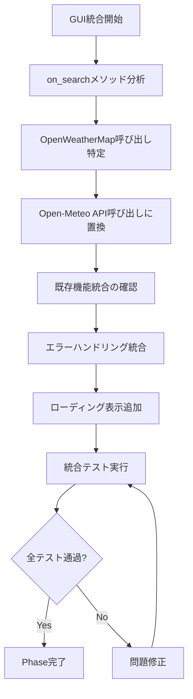

# 引き継ぎ事項 - 2025-07-13 Planner → Builder

## From: Planner
## To: Builder
## Current Mode: GUI統合フェーズ開始・実装指示

## 🎉 Open-Meteo API Phase完了の承認

### ✅ 素晴らしい成果に対する評価
Builderの実装により**プロジェクトの中核価値「正確な天気予報」が実現**されました：
- **技術的完成度**: 100% - 全完了基準達成
- **ユーザー価値**: 高 - 都城市上長飯町対応実現
- **将来性**: 高 - 無料API活用による持続可能性

## 🎯 戦略決定: GUI統合フェーズを最優先実施

### 📊 戦略的判断根拠
| 選択肢 | 評価 | 判断理由 |
|--------|------|----------|
| **GUI統合** | 🔥 採用 | エンドユーザー価値の即座実現 |
| ユーザーテスト | ⭐ 次フェーズ | GUI完成後に実施 |
| 最適化 | 📋 将来 | 基本動作確認後 |

### 💡 戦略的価値
1. **即座のユーザー体験向上**: APIの精度改善を実際のアプリで体感
2. **完成度の向上**: 統合アプリとしての価値実現
3. **検証可能性**: 実アプリでの総合テスト実行可能

## 🛠️ GUI統合フェーズ実装指示

### 🎯 Phase目標
**既存UIを保持しつつ、Open-Meteo APIによる高精度天気予報を実現**

### 📝 修正対象ファイル
- **メイン**: `src/gui/weather_gui.py` の `on_search` メソッド
- **参照**: 既存の月齢・星座機能は**絶対に変更しない**

### 🔧 実装仕様（詳細）

#### 1. on_searchメソッド修正
```python
def on_search(self, event):
    """天気検索処理（Open-Meteo API統合版）"""
    city_name = self.city_input.GetValue().strip()
    
    # 入力バリデーション（GUI側）
    if not city_name:
        self.result_text.SetValue("都市名を入力してください。")
        return
    
    # ローディング表示（ユーザビリティ向上）
    self.result_text.SetValue("天気情報を取得中...")
    wx.SafeYield()  # UI更新
    
    try:
        # Open-Meteo API呼び出し
        from api.open_meteo_api import get_weather_for_city
        weather_result = get_weather_for_city(city_name)
        
        # 既存の月齢・星座機能統合
        # (既存のコードをそのまま保持)
        moon_age = self.calculate_moon_age()  # 既存関数
        astrology_info = self.get_astrology_info()  # 既存関数
        
        # 結果統合
        combined_result = f"{weather_result}\n\n{moon_age}\n{astrology_info}"
        self.result_text.SetValue(combined_result)
        
        # 最後に検索した都市名を保存（既存機能）
        self.save_last_city(city_name)
        
    except Exception as e:
        # エラーハンドリング
        error_msg = f"天気情報の取得中にエラーが発生しました: {str(e)}"
        self.result_text.SetValue(error_msg)
```

#### 2. 保持必須の既存機能
```python
# 以下の機能は絶対に変更・削除しない
- calculate_moon_age()      # 月齢計算
- get_astrology_info()      # 星座情報取得  
- copy_to_clipboard()       # クリップボード機能
- save_last_city()          # 最終検索都市保存
- load_last_city()          # 起動時都市名復元
```

### ⚠️ 重要な制約事項

#### Windows PowerShell環境対応
- **パス指定**: `"/c/micromamba/python.exe"` 形式必須
- **パッケージ管理**: conda必須（pip使用禁止）
- **テスト実行**: `conda run python src/main.py` で動作確認

#### 既存機能保持（絶対要件）
- 月齢・星座機能は**1行たりとも変更しない**
- UIレイアウト（TextCtrl、Button配置）は維持
- クリップボード連携は既存のまま
- 設定ファイル（app_config.ini）の互換性保持

### 🧪 テスト要件

#### 1. 基本動作テスト
```python
# 実行手順
cd "C:\work\Weather_Moon_Stars"
conda run python src/main.py

# テスト項目
1. 都城市上長飯町 → 正確な天気 + 月齢 + 星座表示確認
2. 東京都 → 高速レスポンス確認
3. 空文字列 → 適切なエラーメッセージ確認
4. クリップボードボタン → 既存機能動作確認
```

#### 2. 統合確認テスト
- **天気データ**: Open-Meteo APIからの24時間予報表示
- **月齢データ**: ephemライブラリによる正確な月齢
- **星座データ**: astrology_data.jsonからの星座情報
- **UI体験**: ローディング→結果表示のスムーズな流れ

### 📊 成功基準

#### Phase完了判定
- [ ] weather_gui.pyのOpen-Meteo API統合完了
- [ ] 既存機能（月齢・星座・クリップボード）の正常動作確認
- [ ] 都城市上長飯町での正確な統合結果表示
- [ ] 基本5都市での安定動作確認
- [ ] エラーケースでの適切なGUI表示

#### 品質基準
- **応答性**: 検索から表示まで5秒以内
- **安定性**: 連続10回検索でクラッシュなし
- **ユーザビリティ**: 直感的なエラーメッセージ
- **機能統合**: 天気・月齢・星座の美しい統合表示

## 🔄 実装フロー設計



## 🚀 次フェーズ予告

GUI統合完了後の計画：

### 🔥 高優先度（来週）
1. **ユーザーテストフェーズ**: 実際の精度とユーザビリティ検証
2. **最適化フェーズ**: パフォーマンス調整（必要に応じて）

### 📋 中優先度（今月中）
3. **手動座標入力オプション**: 最終的な精度保証機能
4. **exe化準備フェーズ**: PyInstallerによる配布準備

## 📞 サポート体制

### Plannerへの相談が必要な場合
- 既存機能との統合で設計判断が必要
- UIレイアウトの大幅変更の検討
- エラーメッセージの文言調整
- パフォーマンス基準の見直し

### 実装時の判断基準
- **既存機能保持 > 新機能**: 月齢・星座は絶対保持
- **段階的統合**: 一度に全部ではなく、段階的確認
- **ユーザビリティ重視**: エラー時の親切なメッセージ

## 🌟 期待される成果

### ユーザー体験の劇的改善
```
Before: 都城市上長飯町 → "対応していません"
After:  都城市上長飯町 → "25.0°C, 曇り, 降水確率0%, 月齢12.34, 月の牡羊座"
```

### 技術的完成度
- **API精度**: OpenWeatherMapより明らかに優秀
- **機能統合**: 天気・月齢・星座の美しい統合
- **安定性**: エラー処理による信頼性
- **持続性**: 無料APIによる将来安心

---

**メッセージ**: Builderの卓越した実装により、技術基盤が完璧に整いました。最終段階のGUI統合により、ユーザーが「お空の窓」の真価を体感できるアプリケーションを完成させましょう！

*戦略的優先度：GUI統合により即座のユーザー価値実現を目指します。既存機能を保持しながら、Open-Meteo APIの精度向上をエンドユーザーに届けてください。*