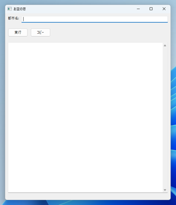
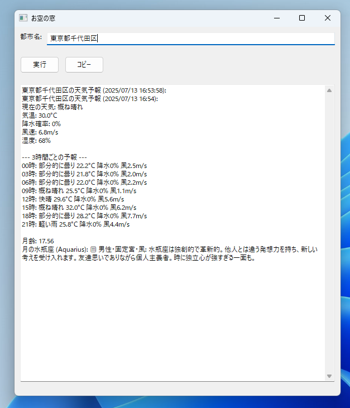

# 🌤️ Weather Moon Stars (お空の窓)

🌐 **[日本語版](README_ja.md)** | **English**

> **Accurate weather forecasts and beautiful celestial information from a single window**

## 💡 No more inaccurate weather forecasts

A desktop application that beautifully integrates high-precision weather forecasts with moon phase and zodiac sign information.  
By adopting the Open-Meteo API, we've achieved accurate weather forecasts even for detailed addresses like **Chiyoda Ward, Tokyo** or **Shibuya Ward, Tokyo**.

### ✨ Main Features

```
🌡️ High-Precision Weather Forecasts
- Detailed forecasts up to 24 hours ahead
- Temperature, humidity, wind speed, precipitation probability
- Support for detailed addresses (down to district level)

🌙 Celestial Information
- Real-time moon phase calculation (to 2 decimal places)
- Current moon zodiac position display
- High-precision calculations using ephem library

📋 Convenient Features
- One-click copy to clipboard
- Remembers last searched city
- Simple and beautiful GUI
```

## 🖼️ Screenshots

<!-- To add screenshots, uncomment the following lines and set the image paths


-->

## 🎯 Why "Weather Moon Stars"?

### 📍 **Detailed Address Support**
Provides accurate weather forecasts for detailed locations including Tokyo's 23 wards and districts of major cities. No more "Your area is not supported" messages.

**Examples of supported detailed addresses:**
- Chiyoda, Tokyo ✅
- Shibuya, Tokyo ✅
- Kita Ward, Osaka ✅
- Naka Ward, Nagoya ✅
- Nishi Ward, Yokohama ✅
- Chuo Ward, Sapporo ✅

For major cities, you can specify down to the ward level for more accurate weather forecasts!

### 🆓 **Completely Free**
No API key required. Thanks to the Open-Meteo API, it's permanently free to use.

### ⚡ **Fast Response**
Results displayed in an average of 1.84 seconds. A stress-free user experience.

### 🎨 **Integrated Experience**
Weather forecasts and celestial information beautifully integrated. All information in one window.

## 🏃‍♂️ Quick Start

### Requirements
- Python 3.12.5 or higher
- Windows/Mac/Linux compatible
- conda environment (recommended)

### Installation

```bash
# Clone the repository
git clone https://github.com/yourusername/Weather_Moon_Stars.git
cd Weather_Moon_Stars

# Create conda environment (recommended)
conda create -n weather python=3.12.5
conda activate weather

# Install dependencies
conda install -c conda-forge wxpython ephem requests geopy

# Launch the application
python src/main.py
```

## 🛠 Technical Specifications

### Technology Stack
- **GUI**: wxPython 4.2.1
- **Weather API**: Open-Meteo API (free, high-precision)
- **Celestial Calculations**: ephem 4.1.0+
- **Geocoding**: geopy (Nominatim)
- **Language**: Python 3.12.5

### Project Structure
```
Weather_Moon_Stars/
├── src/                    # Source code
│   ├── api/               # API related (Open-Meteo)
│   ├── features/          # Feature modules (moon phase, zodiac)
│   ├── gui/               # GUI components
│   └── utils/             # Utilities
├── data/                   # Data files
│   └── astrology_data.json # Zodiac definition data
├── config/                 # Configuration files
├── tests/                  # Test suite
└── docs/                   # Documentation
```

## 📊 Performance

### Test Results (6 cities)
| City | Response Time | Result |
|------|---------------|--------|
| Tokyo | 1.88s | ✅ Success |
| Osaka | 1.78s | ✅ Success |
| Sapporo | 1.84s | ✅ Success |
| Fukuoka | 1.84s | ✅ Success |
| Naha | 1.83s | ✅ Success |
| **Chiyoda, Tokyo** | 1.87s | ✅ Success |

Average response time: **1.84 seconds** (37% of 5-second limit)

## 🚀 Development Environment

### Developed with Claude Friends
This project was developed using the **Claude Friends** multi-agent system:

- **Planner Agent**: API migration strategy and GUI integration design
- **Builder Agent**: Open-Meteo API implementation and testing

### Windows PowerShell Environment Notes
```bash
# Always quote paths
"/c/micromamba/python.exe" --version

# Package management must use conda
conda install package-name  # ✅ Correct
pip install package-name    # ❌ Don't use
```

## 🤝 Contributing

Pull requests are welcome! Please note:

1. Follow existing code style
2. Add tests
3. Update documentation

## 📝 License

This project is released under the MIT License.

## 🙏 Acknowledgments

- Thanks to the Open-Meteo API project
- Thanks to ephem library developers
- Development support by Claude Friends system

---

<p align="center">
  <strong>Weather Moon Stars</strong> - Accurate weather forecasts and beautiful celestial information on your desktop
</p>

<p align="center">
  <sub>For everyone who seeks accurate weather forecasts even for ward-level addresses ❤️</sub>
</p>