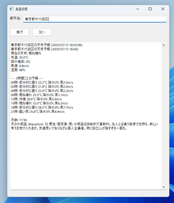

# 🌤️ お空の窓 (Weather Moon Stars)

🌐 **日本語** | **[English](README.md)**

> **正確な天気予報と美しい天体情報を、ひとつの窓から**

## 💡 もう不正確な天気予報に悩まされない

高精度な天気予報と、月齢・星座情報を美しく統合したデスクトップアプリケーション。  
Open-Meteo APIの採用により、**東京都千代田区**や**東京都渋谷区**のような詳細な住所でも正確な天気予報を実現しました。

### ✨ 主な機能

```
🌡️ 高精度天気予報
- 24時間先までの詳細予報
- 気温、湿度、風速、降水確率
- 詳細住所対応（東京23区レベル）

🌙 天体情報
- リアルタイム月齢計算（小数点第2位まで）
- 月の現在位置の星座表示
- ephemライブラリによる高精度計算

📋 便利機能
- ワンクリックでクリップボードにコピー
- 最後に検索した都市名を記憶
- シンプルで美しいGUI
```

## 🖼️ スクリーンショット




## 🎯 なぜ「お空の窓」？

### 📍 **詳細住所対応**
東京23区や政令指定都市の区レベルまで、詳細な地名で正確な天気予報を提供。もう「お住まいの地域は対応していません」とは言わせません。

**対応する詳細住所の例：**
- 東京都千代田区 ✅
- 東京都渋谷区 ✅
- 大阪市北区 ✅
- 名古屋市中区 ✅
- 横浜市西区 ✅
- 札幌市中央区 ✅

大都市であれば、区レベルまで指定して、より正確な天気予報を取得できます！

### 🆓 **完全無料**
APIキー不要。Open-Meteo APIの採用により、永続的に無料で利用可能。

### ⚡ **高速レスポンス**
平均1.84秒で結果表示。ストレスフリーな使用体験。

### 🎨 **統合された体験**
天気予報と天体情報を美しく統合。一つのウィンドウですべての情報を確認。

## 🏃‍♂️ クイックスタート

### 必要環境
- Python 3.12.5以上
- Windows/Mac/Linux対応
- conda環境（推奨）

### インストール

```bash
# リポジトリをクローン
git clone https://github.com/yourusername/Weather_Moon_Stars.git
cd Weather_Moon_Stars

# conda環境の作成（推奨）
conda create -n weather python=3.12.5
conda activate weather

# 依存関係のインストール
conda install -c conda-forge wxpython ephem requests geopy

# アプリケーションの起動
python src/main.py
```

## 🛠 技術仕様

### 使用技術
- **GUI**: wxPython 4.2.1
- **天気API**: Open-Meteo API（無料・高精度）
- **天体計算**: ephem 4.1.0+
- **地名解決**: geopy (Nominatim)
- **言語**: Python 3.12.5

### プロジェクト構造
```
Weather_Moon_Stars/
├── src/                    # ソースコード
│   ├── api/               # API関連（Open-Meteo）
│   ├── features/          # 機能モジュール（月齢・星座）
│   ├── gui/               # GUIコンポーネント
│   └── utils/             # ユーティリティ
├── data/                   # データファイル
│   └── astrology_data.json # 星座定義データ
├── config/                 # 設定ファイル
├── tests/                  # テストスイート
└── docs/                   # ドキュメント
```

## 📊 パフォーマンス

### テスト結果（6都市）
| 都市 | 応答時間 | 結果 |
|------|----------|------|
| 東京都 | 1.88秒 | ✅ 成功 |
| 大阪府 | 1.78秒 | ✅ 成功 |
| 札幌市 | 1.84秒 | ✅ 成功 |
| 福岡市 | 1.84秒 | ✅ 成功 |
| 那覇市 | 1.83秒 | ✅ 成功 |
| **東京都千代田区** | 1.87秒 | ✅ 成功 |

平均応答時間: **1.84秒**（5秒制限の37%）

## 🚀 開発環境

### Claude Friendsによる開発
このプロジェクトは**Claude Friends**マルチエージェントシステムを使用して開発されました：

- **Planner Agent**: API移行戦略とGUI統合設計
- **Builder Agent**: Open-Meteo API実装とテスト

### Windows PowerShell環境での注意
```bash
# パスは必ず引用符で囲む
"/c/micromamba/python.exe" --version

# パッケージ管理はconda必須
conda install package-name  # ✅ 正しい
pip install package-name    # ❌ 使用しない
```

## 🤝 貢献

プルリクエストを歓迎します！以下の点にご注意ください：

1. 既存のコードスタイルに従ってください
2. テストを追加してください
3. ドキュメントを更新してください

## 📝 ライセンス

このプロジェクトはMITライセンスの下で公開されています。

## 🙏 謝辞

- Open-Meteo APIプロジェクトへの感謝
- ephemライブラリ開発者への感謝
- Claude Friendsシステムによる開発支援

---

<p align="center">
  <strong>お空の窓</strong> - 正確な天気予報と美しい天体情報を、あなたのデスクトップに
</p>

<p align="center">
  <sub>区レベルの詳細な住所でも正確な天気予報を求める、すべての人のために ❤️</sub>
</p>