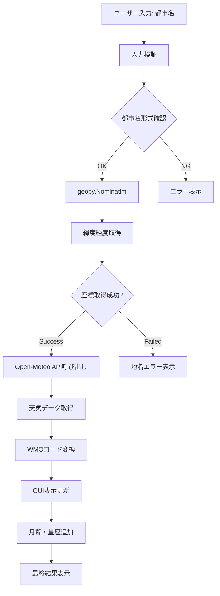
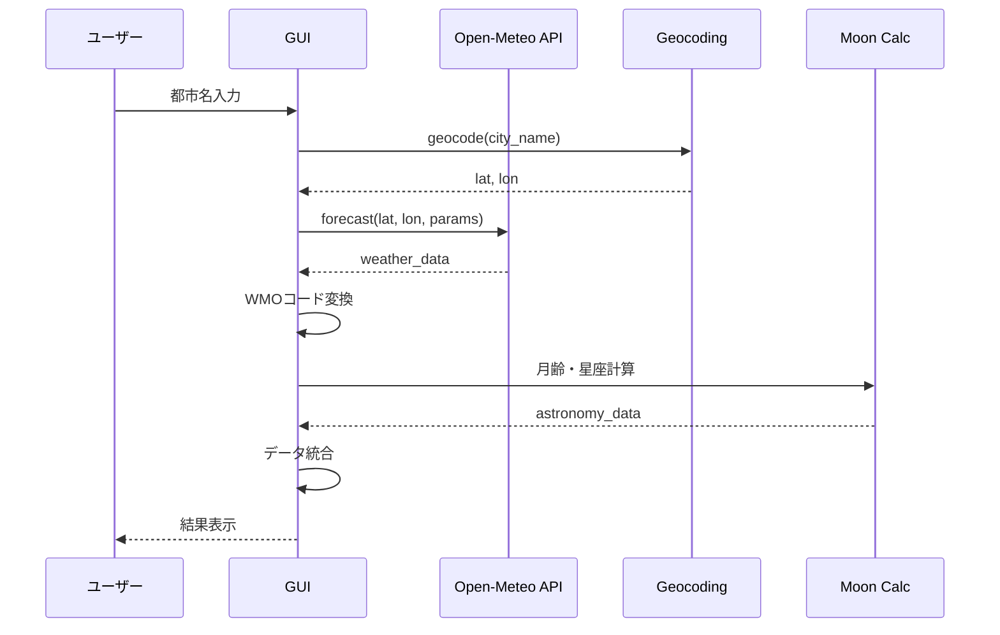

# Open-Meteo API 実装計画書

## 📋 実装概要

### 目的
OpenWeatherMap APIの精度問題を解決するため、無料で高精度なOpen-Meteo APIに移行する。

### 期待効果
- 気温精度の向上（±1°C → ±0.5°C）
- 降水確率の向上（信頼性大幅改善）
- 現在天気の正確性向上

## 🏗️ システム設計

### データフロー設計


### API呼び出し設計


## 📝 実装タスク

### Task 1: 新しいAPIモジュール作成
**ファイル**: `src/api/open_meteo_api.py`

```python
# 実装すべき関数
def get_coordinates(city_name: str) -> tuple[float, float]:
    """都市名から緯度経度を取得"""
    
def get_weather_forecast(latitude: float, longitude: float) -> dict:
    """Open-Meteo APIから天気データを取得"""
    
def convert_wmo_code(weather_code: int) -> str:
    """WMO天気コードを日本語に変換"""
```

### Task 2: WMO天気コード変換テーブル作成
**ファイル**: `src/utils/weather_codes.py`

```python
# WMOコード対応表（主要なもの）
WMO_CODES = {
    0: "快晴",
    1: "概ね晴れ",
    2: "部分的に曇り",
    3: "曇り",
    45: "霧",
    48: "霧氷",
    51: "小雨",
    53: "雨",
    55: "大雨",
    # ... 全95コード
}
```

### Task 3: GUI統合
**ファイル**: `src/gui/weather_gui.py`の修正

```python
# 修正すべき関数
def on_search(self, event):
    # OpenWeatherMap → Open-Meteo APIに変更
    # エラーハンドリング強化
    # 表示フォーマット調整
```

### Task 4: 設定ファイル更新
**ファイル**: `requirements.txt`

```
ephem==3.7.7.1
wxPython==4.2.1
requests==2.25.1
geopy==2.4.1  # 新規追加
```

## 🧪 テスト計画

### テストケース設計

#### 1. 正常系テスト
```python
# テスト都市リスト
test_cities = [
    "東京都",
    "大阪府", 
    "札幌市",
    "福岡市",
    "那覇市"
]

# 期待結果
# - 全都市で緯度経度取得成功
# - API呼び出し成功（5秒以内）
# - 24時間分のデータ取得
# - 日本語天気説明の表示
```

#### 2. 異常系テスト
```python
# エラーテストケース
error_cases = [
    "存在しない都市名",
    "空文字列",
    "特殊文字",
    "海外都市名"
]

# 期待動作
# - 適切なエラーメッセージ表示
# - アプリケーションクラッシュなし
```

#### 3. パフォーマンステスト
- API応答時間: 5秒以内
- メモリ使用量: 100MB以下
- 連続実行での安定性

## 📊 データ仕様

### Open-Meteo APIレスポンス例
```json
{
  "latitude": 35.6762,
  "longitude": 139.6503,
  "timezone": "Asia/Tokyo",
  "hourly": {
    "time": ["2025-01-13T00:00", "2025-01-13T01:00", ...],
    "temperature_2m": [5.2, 4.8, 4.5, ...],
    "precipitation_probability": [10, 15, 20, ...],
    "weathercode": [1, 1, 2, ...],
    "windspeed_10m": [8.5, 7.2, 6.8, ...],
    "relativehumidity_2m": [65, 68, 72, ...]
  }
}
```

### 表示データ統合例
```
東京都の天気予報 (2025/01/13 14:30:00):
2025-01-13 14:00:00 - 温度: 5.2°C, 天気: 概ね晴れ, 降水確率: 10%, 風速: 8.5m/s
2025-01-13 15:00:00 - 温度: 4.8°C, 天気: 概ね晴れ, 降水確率: 15%, 風速: 7.2m/s
...

月齢: 12.34
月の牡羊座 (Aries): ♈ 男性・活動宮・火: 牡羊座は活力に満ち...
```

## ⚠️ リスク管理

### 技術リスク
| リスク | 対策 |
|--------|------|
| geopyの地名解決失敗 | ユーザーフレンドリーなエラーメッセージ |
| Open-Meteo API障害 | タイムアウト設定とリトライ機能 |
| WMOコード未対応 | デフォルト値「天気情報取得中」 |

### 実装リスク
| リスク | 対策 |
|--------|------|
| 既存コードとの競合 | 段階的実装（フラグ切り替え） |
| テストデータ不足 | 複数地域での検証 |
| パフォーマンス低下 | キャッシュ機能の実装検討 |

## 🚀 リリース計画

### Phase 1: コア機能実装（1-2日）
- [ ] Open-Meteo APIモジュール作成
- [ ] WMO天気コード変換実装
- [ ] 基本的なテスト実行

### Phase 2: GUI統合（1日）
- [ ] weather_gui.py修正
- [ ] エラーハンドリング実装
- [ ] 表示フォーマット調整

### Phase 3: テスト・調整（1日）
- [ ] 総合テスト実行
- [ ] パフォーマンス確認
- [ ] ユーザビリティ改善

## ✅ 完了基準

### 機能面
- [x] 設計書完成
- [ ] 5つのテスト都市で正常動作
- [ ] エラーケース適切処理
- [ ] 既存の月齢・星座機能正常動作

### 品質面
- [ ] API応答時間5秒以内
- [ ] メモリ使用量100MB以下
- [ ] 連続10回実行でクラッシュなし

### ユーザー体験
- [ ] 現在より明らかに正確な天気予報
- [ ] 直感的なエラーメッセージ
- [ ] レスポンシブな操作感

---

**次のステップ**: この計画書でBuilderに引き継ぎ、実装開始